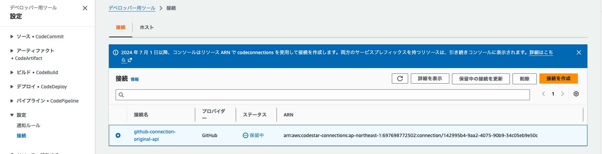
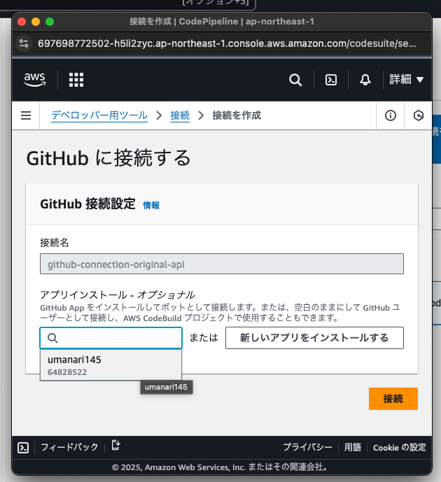
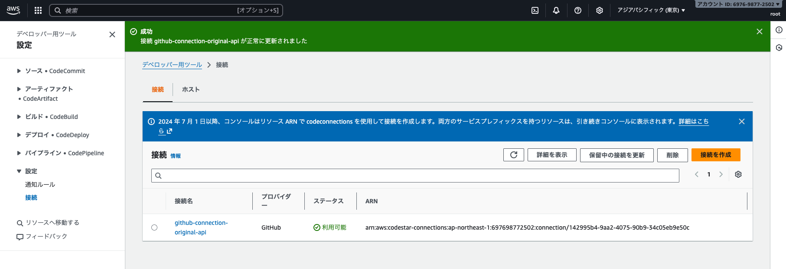
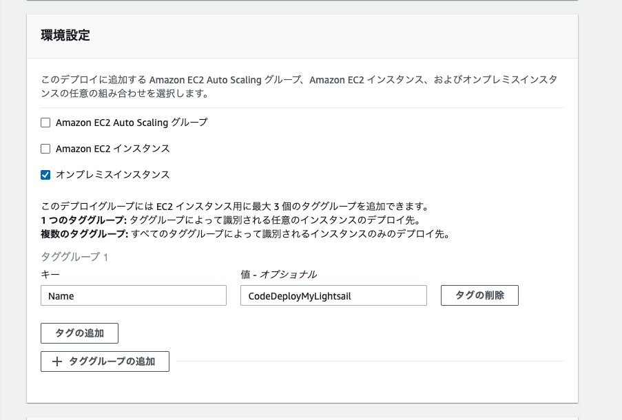
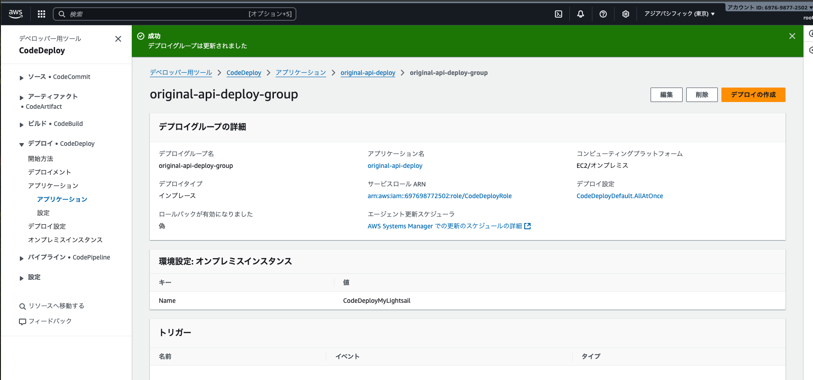

# original_apis_infra

## sourceの登録
保留中になっている

リポジトリを選択

成功していることを確認


## AWS CodeDeploy

https://qiita.com/urushibata/items/d36b5619eb3d51dc4b84<br>
https://zenn.dev/satory074/articles/satory074_2021092201<br>


lightsailへのCodeDeployAgentのinstall
```
sudo apt-get update
sudo apt-get install -y ruby wget
wget https://aws-codedeploy-ap-northeast-1.s3.amazonaws.com/latest/install
sudo chmod +x ./install
sudo ./install auto
```

EC2ならこのままインスタンスをCodeDeployにアタッチするだけで良いが、lightsailはオンプレ扱いなので、下記の登録が必要<br>
/etc/codedeploy-agent/conf/codedeploy.onpremises.yml に以下を追加<br>
(ファイル名に注意! codedeploy.ymlに追加しても動かない)
```
aws_access_key_id: *****
aws_secret_access_key: *****
iam_user_arn: ******
region: ap-northeast-1
```
#### オンプレミスデプロイグループの登録
オンプレとしての登録(タグも登録)

確認

## デプロイエージェントの登録
オンプレミスの登録<br>
regionはlightsailのregion<br>
instance-nameはarnではなくlightsailの名称
```
aws deploy register-on-premises-instance --instance-name LAMP_PHP_8-1  --iam-user-arn arn:aws:iam::697698772502:user/for_awslightsail --region ap-northeast-1  --profile for_awslightsail

aws deploy add-tags-to-on-premises-instances --instance-names LAMP_PHP_8-1  --tags Key=Name,Value=CodeDeployMyLightsail --region ap-northeast-1 --profile for_awslightsail

aws deploy list-on-premises-instances --region ap-northeast-1 --profile for_awslightsail
```

登録解除(画面から外せないので要注意)
```
aws deploy deregister-on-premises-instance --instance-name LAMP_PHP_8-1 --profile norio
```

登録を確認する方法は？<br>
lightsailのログをみて受付OKになっているか確認をする

tail -1000 /var/log/aws/codedeploy-agent/codedeploy-agent.log

以下の状態になっていればagent側が受付OKにはなっている
```
2025-11-23T13:57:38 INFO  [codedeploy-agent(626040)]: Version file found in /opt/codedeploy-agent/.version with agent version OFFICIAL_1.8.0-17_deb.
2025-11-23T13:58:23 INFO  [codedeploy-agent(626040)]: [Aws::CodeDeployCommand::Client 200 45.335323 0 retries] poll_host_command(host_identifier:"arn:aws:iam::697698772502:user/norio_202407") 
```

codededeploy-agentの停止、開始、確認
```
sudo systemctl stop codedeploy-agent
sudo systemctl start codedeploy-agent
sudo systemctl status codedeploy-agent
● codedeploy-agent.service - LSB: AWS CodeDeploy Host Agent
     Loaded: loaded (/etc/init.d/codedeploy-agent; generated)
     Active: active (running) since Sun 2025-11-23 13:53:00 UTC; 9s ago
       Docs: man:systemd-sysv-generator(8)
    Process: 626032 ExecStart=/etc/init.d/codedeploy-agent start (code=exited, status=0/SUCCESS)
      Tasks: 2 (limit: 510)
     Memory: 56.3M
        CPU: 1.187s
     CGroup: /system.slice/codedeploy-agent.service
             ├─626038 "codedeploy-agent: master 626038"
             └─626040 "codedeploy-agent: InstanceAgent::Plugins::CodeDeployPlugin::CommandPoller of master 626038"

```
またappspec.ymlの登録やディレクトリがないと、
```
The deployment failed because no instances were found for your deployment group. Check your deployment group settings to make sure the tags for your Amazon EC2 instances or Auto Scaling groups correctly identify the instances you want to deploy to, and then try again.
```

https://syuntech.net/aws/aws-codedeploy_error/#google_vignette
codepipelineとawslightsailとprofileのregionをできれば統一すべき！<br>
そうしないとインスタンスが見つからない・・・となってしまう！